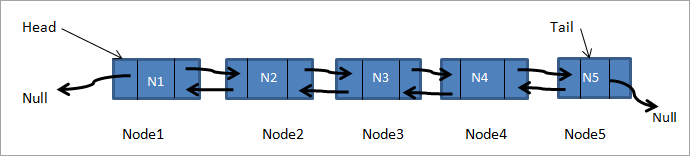

# Doubly Linked List Data Structure In C++
**University:** Amirkabir University of Tehran  
**Course:** Advanced Programming  
**Instructor:** Dr. Amir Jahanshahi

**Student:** Mohammad Arabzadeh  
**Email:** a.mohamad7824@gmail.com  
## Introduction
In this project, I've implemented the doubly linked list data structure in c++.  
<p align="center">
        <br>
        <em>A basic layout of the doubly linked list. Image from <a href="https://www.softwaretestinghelp.com/doubly-linked-list-2/">softwaretestinghelp</a>.</em>
</p>

## LinkedList Class
This class represents each LinkedList object. It has the following methods and member variables.
```c++
class LinkedList {
public:
    class Node {
    public:
        Node();
        Node(double);
        Node* next;
        Node* previous;
        double getValue() const;
        double& getValue();
        void setValue(double);
        friend std::ostream& operator<<(std::ostream& stream, const Node& node);

    private:
        double value;
    };
    LinkedList();
    LinkedList(std::initializer_list<double>);
    LinkedList(const LinkedList&);
    ~LinkedList();
    void push_back(double);
    void push_front(double);
    double pop_back();
    double pop_front();
    double back() const;
    double front() const;
    bool empty();
    void clear();
    void show() const;
    int getSize() const;
    void extend(const LinkedList&);
    double& operator[](int);

private:
    int N {};

public:
    Node* head;
    Node* tail;
};
```  
```Node``` class is a nested class, which means that we have defined the class inside another class.
